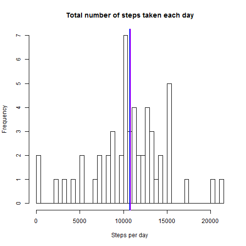
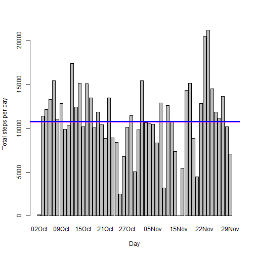
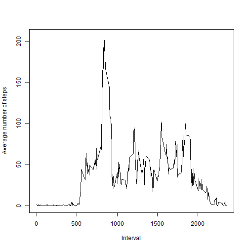
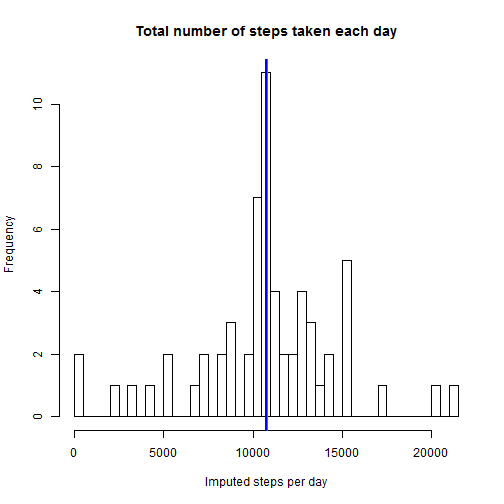
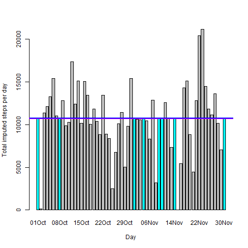
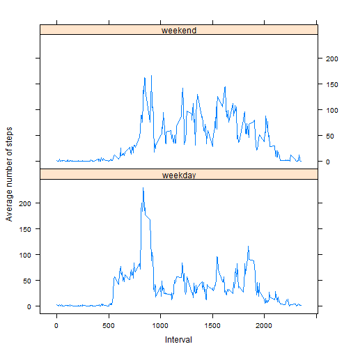

# Reproducible Research: Peer Assessment 1
*github repository in [here][1]*
[1]: https://github.com/jcllorente/RepData_PeerAssessment1 "here"


## Loading and preprocessing the data

- Load the data: original data file "activity.zip" (or unzipped "activity.csv) expected in default working directory.  


```r
if (!file.exists("activity.csv")) unzip("activity.zip")
datos <- read.csv("activity.csv")
```


Summary information of data frame, with 17568 rows and 3 columns, included below:


```r
summary(datos)
```

```
##      steps               date          interval   
##  Min.   :  0.0   2012-10-01:  288   Min.   :   0  
##  1st Qu.:  0.0   2012-10-02:  288   1st Qu.: 589  
##  Median :  0.0   2012-10-03:  288   Median :1178  
##  Mean   : 37.4   2012-10-04:  288   Mean   :1178  
##  3rd Qu.: 12.0   2012-10-05:  288   3rd Qu.:1766  
##  Max.   :806.0   2012-10-06:  288   Max.   :2355  
##  NA's   :2304    (Other)   :15840
```

```r
str(datos)
```

```
## 'data.frame':	17568 obs. of  3 variables:
##  $ steps   : int  NA NA NA NA NA NA NA NA NA NA ...
##  $ date    : Factor w/ 61 levels "2012-10-01","2012-10-02",..: 1 1 1 1 1 1 1 1 1 1 ...
##  $ interval: int  0 5 10 15 20 25 30 35 40 45 ...
```


- Process/transform the data (if necessary) into a format suitable for analysis: 

1. Field names capitalized for direct use figures and tables.
2. Date field converted from factor class to date class


```r
names(datos) <- c("Steps", "Date", "Interval")
datos$Date <- as.Date(datos$Date)
```


## What is mean total number of steps taken per day?

For this part of the assignment, missing (NA) values in the dataset are ignored, by using defaults of functions.

- Make a histogram of the total number of steps taken each day: 

1. Year 2012 ommitted from names in x-axis, apllying to all of them  
2. Added magenta line with mean number of steps per day  
3. Added blue line with median number of steps per day  


```r
stbyday <- aggregate(Steps ~ Date, datos, sum)
names(stbyday)[2] <- "SumSteps"

# Basic frequency histogram
with(stbyday, hist(SumSteps, breaks = nrow(stbyday), xlab = "Steps per day", 
    main = "Total number of steps taken each day"))
abline(v = mean(stbyday$SumSteps), col = "magenta", lwd = 3)
abline(v = median(stbyday$SumSteps), col = "blue", lwd = 2)
```

 

```r

# Elaborated steps per day histogram
barplot(stbyday$SumSteps, xlab = "Day", ylab = "Total steps per day", names.arg = as.character(strftime(stbyday$Date, 
    "%d%b")))
abline(h = mean(stbyday$SumSteps), col = "magenta", lwd = 3)
abline(h = median(stbyday$SumSteps), col = "blue", lwd = 2)
```

 


- Calculate and report the **mean** and **median** total number of steps taken per day
   

```r
mean(stbyday$SumSteps)
```

```
## [1] 10766
```

```r
median(stbyday$SumSteps)
```

```
## [1] 10765
```


In one sentence: mean total steps taken per day is 1.0766 &times; 10<sup>4</sup> while median total steps taken per day is 10765

## What is the average daily activity pattern?

- Make a time series plot (i.e. `type = "l"`) of the 5-minute interval (x-axis) and the average number of steps taken, averaged across all days (y-axis)
   

```r
stint <- aggregate(Steps ~ Interval, datos, mean)
names(stint)[2] <- "MeanSteps"
plot(stint, type = "l", xlab = "Interval", ylab = "Average number of steps")
abline(v = stint$Interval[which.max(stint$MeanSteps)], col = "red", lwd = 1, 
    lty = 3)
```

 


- Which 5-minute interval, on average across all the days in the dataset, contains the maximum number of steps?


```r
stint$Interval[which.max(stint$MeanSteps)]
```

```
## [1] 835
```


Interval is marked with a dotted red line in above plot.

## Imputing missing values

- Calculate and report the total number of missing values in the dataset 
(i.e. the total number of rows with `NA`s)

As already shown in the summary information presented upon reading the original data, there are 2304 rows with missing values, all of them corresponding to column Steps and just 8 dates,  listed below.


```r
sum(is.na(datos))
```

```
## [1] 2304
```

```r
summary(as.factor(datos$Date[is.na(datos)]))
```

```
## 2012-10-01 2012-10-08 2012-11-01 2012-11-04 2012-11-09 2012-11-10 
##        288        288        288        288        288        288 
## 2012-11-14 2012-11-30 
##        288        288
```


- Devise a strategy for filling in all of the missing values in the dataset. The strategy does not need to be sophisticated. For example, you could use     the mean/median for that day, or the mean for that 5-minute interval, etc.

- Create a new dataset that is equal to the original dataset but with the missing data filled in.
   
Using the mean/median for that day will add just zeros, as missing values corresponds to all measurements of specific data. Using the means for that 5-minute intervals for filling all 2304 missing "Steps" values.


```r
datosf <- merge(datos, stint, by = "Interval")
bad <- is.na(datosf$Steps)
datosf$Steps[bad] <- datosf$MeanSteps[bad]
```


- Make a histogram of the total number of steps taken each day and calculate and report the **mean** and **median** total number of steps taken per day. Do these values differ from the estimates from the first part of the assignment? What is the impact of imputing missing data on the estimates of the total daily number of steps?


```r
stfbyday <- aggregate(Steps ~ Date, datosf, sum)
names(stfbyday)[2] <- "SumSteps"
stfmean <- mean(stfbyday$SumSteps)
stfmedian <- median(stfbyday$SumSteps)

# Basic frequency histogram
with(stfbyday, hist(SumSteps, breaks = nrow(stfbyday), xlab = "Imputed steps per day", 
    main = "Total number of steps taken each day"))
abline(v = stfmean, col = "magenta", lwd = 3)
abline(v = stfmedian, col = "blue", lwd = 2)
```

 

```r

# Elaborated steps per day histogram
stfbyday$color <- "grey"
stfbyday$color[stfbyday[, 1] %in% unique(datosf$Date[bad])] <- "cyan"
with(stfbyday, barplot(SumSteps, xlab = "Day", ylab = "Total imputed steps per day", 
    col = color, names.arg = as.character(strftime(Date, "%d%b"))))
abline(h = stfmean, col = "magenta", lwd = 3)
abline(h = stfmedian, col = "blue", lwd = 2)
```

 

```r

# Report of mean and median
stfmean
```

```
## [1] 10766
```

```r
stfmean - mean(stbyday$SumSteps)
```

```
## [1] 0
```

```r
stfmedian
```

```
## [1] 10766
```

```r
stfmedian - median(stbyday$SumSteps)
```

```
## [1] 1.189
```


Impact of the missing data is close to zero, as it might have been expected:

1. Once mean values has been used to fill the gaps, overall means does not change, and median just a little bit  
2. Grand total number of Steps has grown from 570608 to 6.5674 &times; 10<sup>5</sup>  
3. There are 8 more days of data in the new data frame, as displayed in the histograms above in cyan color, right on the mean which goes from 3 to 11 in frequency.

## Are there differences in activity patterns between weekdays and weekends?

- Create a new factor variable in the dataset with two levels, "weekday" 
and "weekend", indicating whether a given date is a weekday or weekend day.


```r
datosf$typeday <- "weekday"  #initialize as character variable
wkend <- weekdays(as.Date(datosf$Date)) %in% c("Saturday", "Sunday")
datosf$typeday[wkend] <- "weekend"  #update days corresponding to week-ends
datosf$typeday <- as.factor(datosf$typeday)  #convert to factor
```


- Make a panel plot containing a time series plot (i.e. `type = "l"`) of the 5-minute interval (x-axis) and the average number of steps taken, averaged across all weekday days or weekend days (y-axis).


```r
stbywi <- aggregate(Steps ~ typeday + Interval, datosf, mean)
xyplot(Steps ~ Interval | typeday, data = stbywi, type = "l", layout = c(1, 
    2), ylab = "Average number of steps")
```

 


The following differences in patterns have been identified a priori from the graphs produced:

1. Number of steps in weekends are more evenly distributed over intervals, with a number of more or less similar peaks between intervals 800 and 1800 and a higher average in-between.

2. In weekdays, however, there is a big peak around interval 835, and just a few more aound intervals 1200, 1600 and 190, and a lower average in-between.

3. Activity in weekdays starts "sooner", perhaps because of work requirements and/or longer sleep in the start of weekends.

4. On the other hand, in weekends the activity seems to finish a bit "later" than in weekdays: last peek may correspond with a later come-back to home.

5. Maximum average number of steps in weekdays in about double that in weekends, perhaps matching with some activity happening before-lunch.
